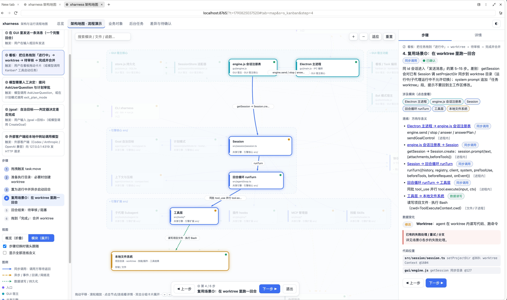
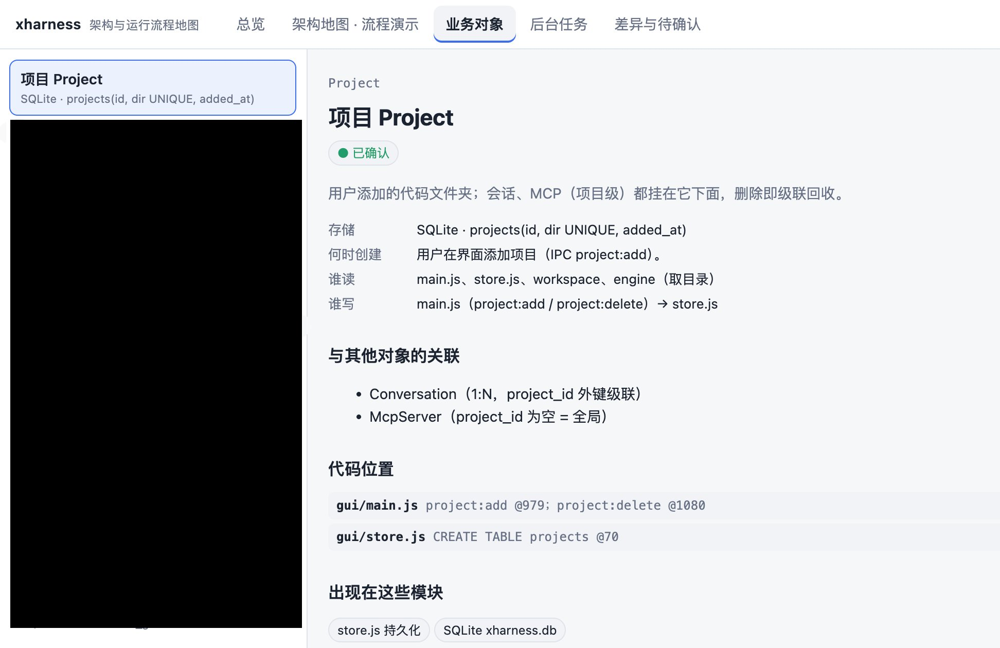
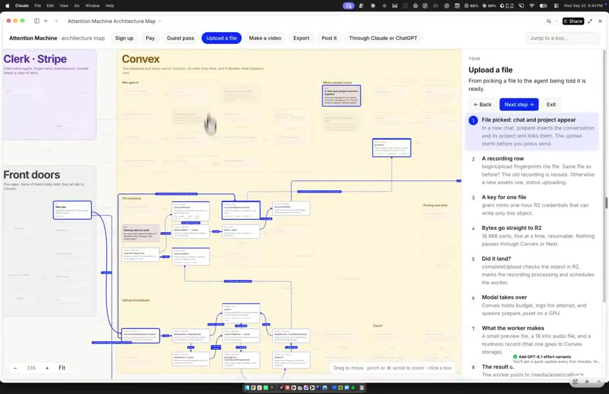
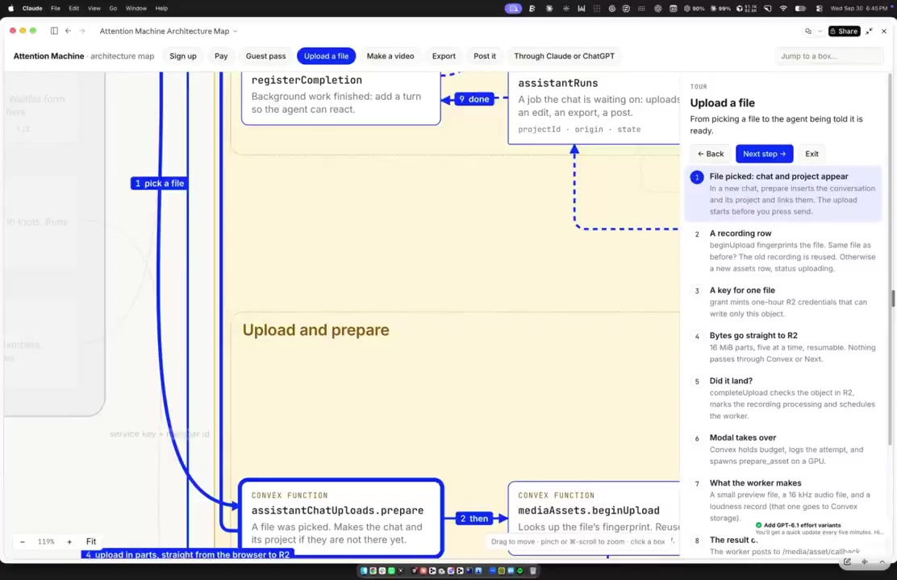

# justin-skills

Justin 收藏与整理的 Agent Skills（可直接丢进 Claude Code / Cursor 等支持 `SKILL.md` 的工具）。

首页只列已收录的 skill；正文尽量保持来源原样。

## Skills

| Skill | 解决啥 |
|-------|--------|
| [project-architecture-map](skills/project-architecture-map/SKILL.md) | 功能迭代太快、自己对架构跟不上时，让模型按真实代码画出可交互的架构与运行流程地图（能缩放、点步骤、看流向），而不是又一份静态 wiki。 |

### 1. project-architecture-map（本仓第一个）

- **路径：** `skills/project-architecture-map/SKILL.md`
- **我们用的版本：** [LinearUncle 的 Gist](https://gist.github.com/linearuncle/f9e22e01477c44c328f8e34103ec5fd2)（通用转写，原样封装进 `SKILL.md`）
- **转写贴：** [LinearUncle](https://x.com/LinearUncle/status/2105506429788422409)（引用下面原帖）
- **灵感原帖：** [Robin Ebers](https://x.com/robinebers/status/2105309987983745060)（针对他自己项目的口语提示词，完整版在[首条回复](https://x.com/robinebers/status/2105309990835933399)）

#### 效果示意

通用版实测（来自 [LinearUncle 帖里的图](https://x.com/LinearUncle/status/2105506429788422409)）：可交互流程演示 + 业务对象说明。

原作者项目上的画布观感（来自 [Robin 演示视频](https://x.com/robinebers/status/2105309987983745060) 截帧；完整短视频见 [`robinebers-demo.mp4`](skills/project-architecture-map/assets/robinebers-demo.mp4)）：

#### 关系（顺着两帖就懂）

Robin 先发了「对我自己这个大 App 说的一段话」当提示词，让 Opus 画出可缩放、可点的架构画布。LinearUncle **引用该帖**，说明原作者提示词是**项目特化**的，于是让 AI **改写成通用版**，放到 Gist；本仓第一个 skill 用的就是这份通用版，可以。

#### 解决啥（两帖 + 评论区汇总）

**痛点**

- 功能跑得比脑子快：Robin 自己说两三个月猛迭代，经常在**追赶架构**，对 Model / 存储 / worker 怎么串起来已经说不清。
- AI 写代码时更容易「只顾交付、脑子里没有全图」：评论里有人说容易被带跑，事后才发现实现脆弱、不对路；也有人拿来捡起搁置很久的旧项目重新摸清结构。
- 纯文档不够用：LinearUncle 对比 Devin deepwiki——wiki **偏文档**；这边要的是**可视化地图**。中文评论也提到 deepwiki 更新滞后、少一张能一眼看全局的图；有人直接说要避免「黑箱」、看清进度和执行方向。

**做法**

- 不是再要一张普通流程图 / Mermaid 截图，而是一张**可交互画布**：缩放、拖动、按关键动作点开，看部件怎么亮、下一步到底发生了什么（Robin 在评论里强调：叫它 flowchart 是低估了）。
- 地图应对着**真实代码里的东西**（路由、存储、worker、依赖边），不能只是画着好看的猜测；评论区也在催「点节点跳回源码」「边上的箭头能对到代码」。
- 通用版提示词把「先读懂项目 → 追关键流程 → 出交互画布 → 有证据」写成可复用步骤，换项目也能直接用。

用法：把该目录装进你的 skills 目录，或把 `SKILL.md` 正文当作提示词直接粘贴给模型。

## 许可与归属

各 skill 正文归属原作者；本仓仅作收藏与 `SKILL.md` 封装。效果图来自上述公开帖，仅作示意。若原作者要求调整，开 issue 或联系 Justin。
